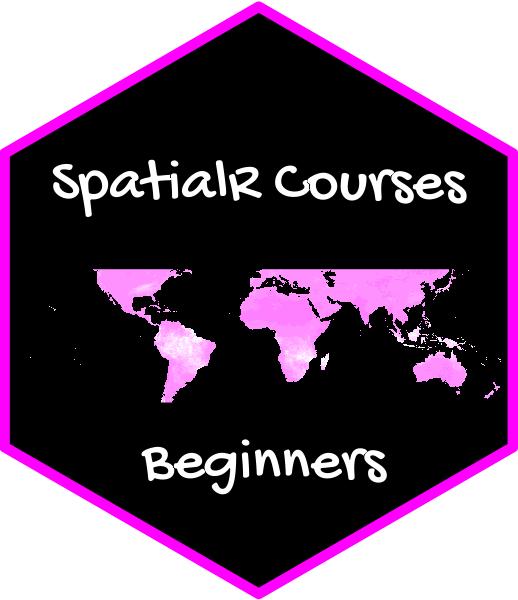

# AGEPbeginners  

> This package contains the lectures and exercises used in the course **Spatial analysis with R - Beginners course**:

- 1.  Introduction to R - Part 1

- 2.  Introduction to R - Part 2

- 3.  Raster files and spatial data

- 4.  Data processing

- 5.  Spatial and temporal statistics

- 6.  Automating downloading

### Installation and usage

Make sure that devtools are installed:
```r
install.packages("devtools")
```
Install the AGEPbeginners package from GitHub :
```r
remotes::install_github("obaezvil/AGEPbeginners")
```
Load the package:
```r
library(AGEPbeginners)
```
Open the first lecture:
```r
render_lectures("Lecture1") 
```
